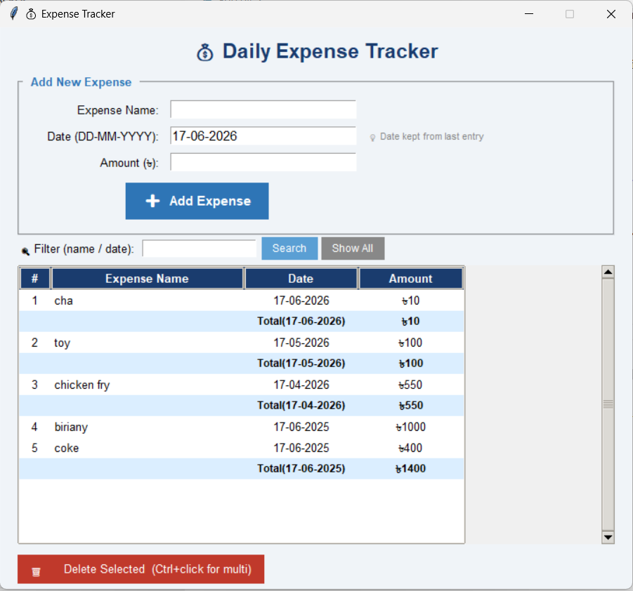

# 💰 Daily Expense Tracker

A desktop application to track daily expenses built with Python and Tkinter.
## Screenshot

## Features
- Add expenses with name, date and amount
- Expenses grouped date-wise automatically
- Daily total shown after each date group
- Multi-row delete (Ctrl+click to select multiple)
- Search and filter by name or date
- Data saved permanently to CSV file
- Works across multiple sessions

## How to Run
1. Install Python from python.org
2. Download app.py
3. Open terminal in the same folder
4. Run:
python app.py

## Built With
- Python
- Tkinter (GUI)
- CSV (data storage)
